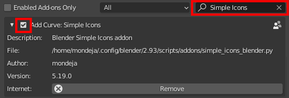
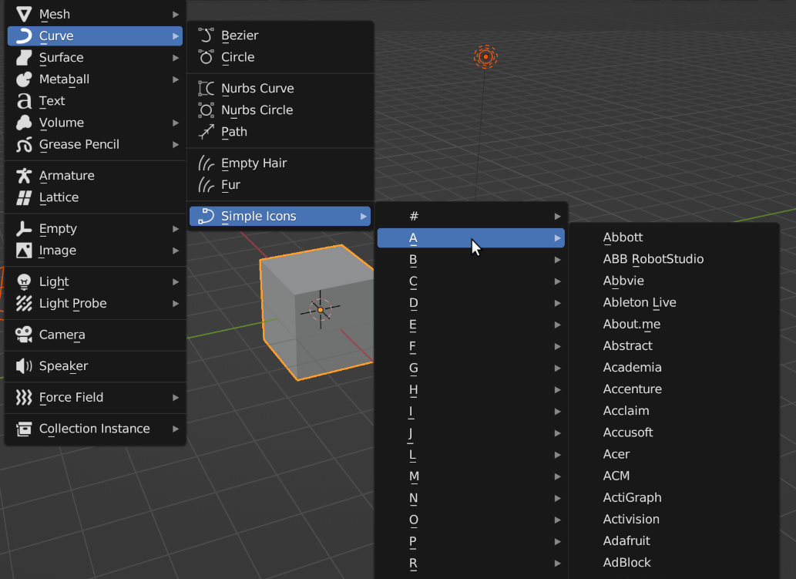
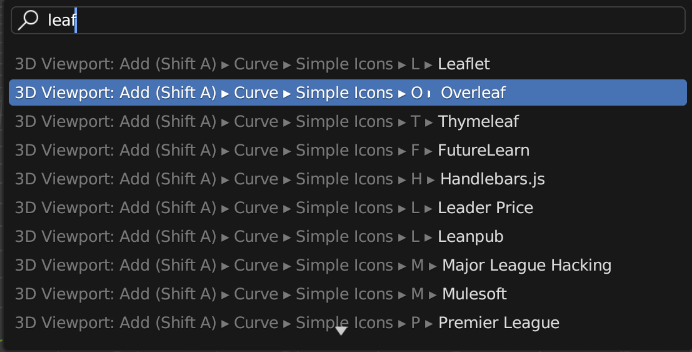
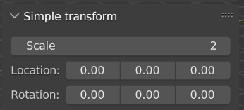
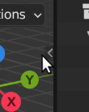

# simple-icons-blender

[Simple Icons] Blender addon. Add 2D SVG brand icons to Blender easily.

Requires Blender v2.93.0 or greater.

[![Verify Workflow][tests-badge]][tests-link]

## Download

Download the addon using [the next link](https://github.com/mondeja/simple-icons-blender/releases/download/14.12.1/simple_icons_blender.py):

```txt
https://github.com/mondeja/simple-icons-blender/releases/download/14.12.1/simple_icons_blender.py
```

If you want to install [another version of Simple Icons][si-releases], change the version
number in the link.

## Install

Under `Edit` -> `Preferences` -> `Add-ons`, press on `Install` and select the
downloaded file:

<p align="center">
  
</p>

Search for `Simple Icons` in the search bar and enable the addon marking the
top-left checkbox:

<p align="center">
  
</p>

## Usage

You can load icons from the `3D Viewport` in object mode clicking on `Add` ->
`Curve` -> `Simple Icons`:

<p align="center">
  
</p>

All icons are operators, so you can directly load one through the `Menu Search`
(`Edit` -> `Menu Search`):

<p align="center">
  
</p>

After loading the icon, you can use the built-in panel "Simple transform"
to define the size, location and rotation easily.

<p align="center">
  
</p>

Is placed inside the "Item" tab at the top right of the 3D viewport:

<p align="center">
  
</p>

This panel will only be shown when you select a *Curve* object as the active one.

[Simple Icons]: https://simpleicons.org
[si-releases]: https://github.com/simple-icons/simple-icons/releases
[tests-link]: https://github.com/mondeja/simple-icons-blender/actions/workflows/verify.yml
[tests-badge]: https://img.shields.io/github/actions/workflow/status/mondeja/simple-icons-blender/verify.yml?branch=develop&label=tests
